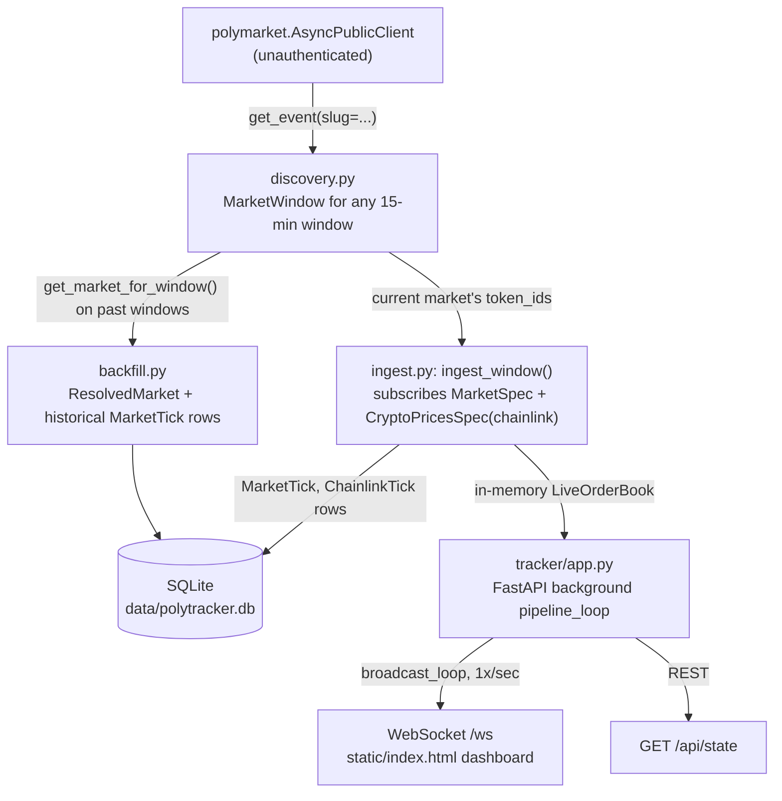

# Polymarket BTC 15-Minute Tracker: Technical Design

This document is a complete technical reference for this codebase, written to be loaded whole into an agent's context.
It should let an agent (or a human) pick up work here with no other conversation history and no need to re-derive facts already established by testing against the live API.
If anything here goes stale, update this file in the same change that makes it stale - do not let it drift.

Related documents, each with a distinct job:
- `README.md` - short human-facing summary, status table, how to run things.
- `AGENTS.md` - general engineering guidelines (not project-specific).
- `.claude/skills/polymarket-client/SKILL.md` - a load-on-demand reference for `polymarket-client` library gotchas, meant to be pulled in only when writing/debugging code that touches the `polymarket` package. This document duplicates the load-bearing parts of it inline (see "The polymarket-client library" below) so a reader does not have to jump between files, but the skill file is the canonical source if the two ever disagree.

## 1. What this project is

A live tracker and data pipeline for Polymarket's recurring 15-minute Bitcoin Up/Down markets.
Each market asks: is the BTC/USD price at the end of a 15-minute window greater than or equal to the price at the start of that window?
Yes resolves the market to "Up", no resolves it to "Down".

The resolution oracle is Chainlink's BTC/USD Data Stream (`data.chain.link/streams/btc-usd`), stated explicitly in each market's description and `resolution.source` field.
Polymarket's own public realtime feed happens to stream that exact Chainlink value for free and without authentication (see section 5).
This was the single biggest planning surprise on this project: an earlier planning pass assumed paid Chainlink Data Streams credentials might eventually be needed for a live trading strategy to track the resolution price precisely, and that assumption turned out to be wrong once tested against the real API.

**No API keys, accounts, or credentials of any kind are required for anything currently built.** Everything runs against `polymarket.AsyncPublicClient`, which is fully unauthenticated. Credentials would only enter the picture for a possible future Phase 5 (placing real orders via `AsyncSecureClient`), which is not built and not a default next step.

### Phases and status

| # | Phase | Status |
|---|---|---|
| 1 | Market discovery | Done |
| 2 | Data pipeline (realtime ingestion + historical backfill) | Done |
| 3 | Live tracker dashboard (FastAPI + WebSocket) | Done |
| 4 | Backtest engine | **Skipped by explicit user request**, not started. The data model was designed to support it without changes; see section 9. |
| 5 | Live trade execution | Not started, not planned by default. Would need `AsyncSecureClient` plus a private key, funded Polygon wallet, and (for wallet ops) a Relayer API key. |

### Engineering approach: no mocks

Every test in `tests/` runs end-to-end against the real, live Polymarket API.
There is no mock server and no recorded-fixture replay.
This was a deliberate choice: the `polymarket-client` package is beta (`0.1.0b16` as of writing) and its actual behavior differs from its own prose documentation in several places (see section 5).
Mocking against assumed behavior would have baked in wrong assumptions and hidden real bugs, several of which were only caught by hitting the live service (see section 8, "Bugs found by testing live").
The tradeoff is that the suite needs network access and takes roughly 20-30 seconds; there is no offline/CI-only mode.

## 2. Repository layout

```
src/polytracker/
  discovery.py          # find MarketWindow objects for any 15-min window, past/current/next
  store.py               # SQLModel tables + engine/session factories
  ingest.py               # realtime ingestion worker (one market window at a time) + in-memory LiveOrderBook
  backfill.py             # historical resolved-outcome + price-history backfill for past windows
  tracker/
    app.py                # FastAPI app: runs the ingestion pipeline in the background, serves a WebSocket + REST snapshot
    static/index.html      # dashboard frontend: vanilla HTML/CSS/JS, no build step, no framework
tests/
  test_discovery.py        # 6 tests
  test_ingest.py            # 1 test (short live ingestion window)
  test_backfill.py          # 3 tests (against known historical resolved markets)
  test_tracker_app.py       # 3 tests (FastAPI TestClient + WebSocket)
.claude/skills/polymarket-client/SKILL.md   # loadable reference notes for the polymarket-client package
DESIGN.md                  # this file
README.md                  # human-facing summary
AGENTS.md                  # general engineering guidelines
```

There is no `backtest/` package. That is Phase 4, currently skipped (section 9 describes how to build it against the existing schema).

## 3. Data flow



Two independent consumers write to the same SQLite database using the same `ingest_window()` function: the standalone ingestion pipeline (not currently wired to a CLI entry point, but usable via `ingest.run_forever()`) and the live tracker dashboard (`tracker/app.py`, which runs its own copy of the same per-window loop so that opening the dashboard is sufficient to also be collecting backtest data).

## 4. Module reference

### 4.1 `discovery.py`

Purpose: turn "which market is this" into a pure computation instead of a search/pagination call, by exploiting a fixed, discovered slug pattern.

- `WINDOW_SECONDS = 900`, `SLUG_PREFIX = "btc-updown-15m"`.
- `window_start_for(ts: float) -> int` - aligns any unix timestamp down to its containing 900-second window start (`epoch - epoch % 900`).
- `slug_for_window(window_start_epoch: int) -> str` - returns `"btc-updown-15m-{epoch}"`.
- `MarketWindow` (frozen dataclass) - the resolved representation of one market: `slug`, `condition_id`, `up_token_id`, `down_token_id`, `window_start`, `window_end` (both `datetime`, UTC), `closed: bool`, `outcome: str | None` (`"up"` / `"down"` / `None` if not yet resolved).
- `get_market_for_window(client, window_start_epoch) -> MarketWindow` - the one real network call. Fetches `client.get_event(slug=...)`, takes `.markets[0]`. Raises `MarketNotFoundError` (not the raw `RequestRejectedError` the library raises internally) if the slug does not exist yet. Derives `outcome` from `market.outcomes.yes.price == 1` (up) or `market.outcomes.no.price == 1` (down); leaves `None` if neither (i.e. still open).
- `get_current_market(client, *, now=None) -> MarketWindow` - convenience wrapper around `get_market_for_window(client, window_start_for(now or time.time()))`.
- `get_next_market(client, current) -> MarketWindow` - fetches the window immediately following `current`, computed from `current.window_start`, not from wall-clock time (so it is safe to call repeatedly in a loop without drift).

No caching, no retries in this module itself - see `tracker/app.py`'s `_get_current_with_retry` / `_get_next_with_retry` for the retry wrapper used where transient "next window not created yet" gaps matter.

### 4.2 `store.py`

Purpose: SQLite persistence via SQLModel (SQLAlchemy + Pydantic).

Tables:

- **`MarketTick`** - one row per best-bid/ask update or last-trade update for one outcome token. Columns: `id` (PK, autoincrement), `ts: datetime` (indexed), `market_slug: str` (indexed), `token_id: str` (indexed), `side: str` (`"up"` or `"down"`, stored as plain `str` - see section 8 for why), `best_bid: float | None`, `best_ask: float | None`, `midpoint: float | None`, `last_trade_price: float | None`. A single logical tick may be split across two rows if it updates both best-bid/ask and last-trade-price at different moments; consumers should not assume every row has every field populated.
- **`ChainlinkTick`** - one row per BTC/USD price update from Polymarket's public Chainlink feed. Columns: `id` (PK), `ts: datetime` (indexed), `symbol: str` (indexed, always `"btc/usd"` today), `price: float`.
- **`ResolvedMarket`** - one row per closed market, the backtest ground-truth label. Columns: `slug: str` (PK), `condition_id: str`, `up_token_id: str`, `down_token_id: str`, `window_start: datetime` (indexed), `window_end: datetime`, `outcome: str` (`"up"` or `"down"`).

Functions:
- `make_engine(db_path=DEFAULT_DB_PATH)` - creates the parent directory if needed, creates a SQLite engine, calls `SQLModel.metadata.create_all()`. `DEFAULT_DB_PATH = Path("data/polytracker.db")`, gitignored.
- `get_session(engine) -> Session` - returns a `Session` with **`expire_on_commit=False`**. This is a deliberate deviation from the SQLAlchemy default; see section 8 for the bug this fixes.

There is no migration tooling (no Alembic). Schema changes today mean deleting and rebuilding `data/polytracker.db`, which is acceptable since it holds recreatable market data, not user data.

### 4.3 `ingest.py`

Purpose: the realtime ingestion worker, and the in-memory live-book state the dashboard reads from.

- `CHAINLINK_BTC_SYMBOL = "btc/usd"`.
- `LiveOrderBook` (plain dataclass, not persisted) - `books: dict[token_id, MarketBookEvent]` (full depth, latest snapshot only), `best: dict[token_id, MarketBestBidAskEvent]`, `last_trade: dict[token_id, MarketLastTradePriceEvent]`, `btc_price: float | None`, `btc_price_ts: float | None`. This exists so the dashboard does not need to hit SQLite on every broadcast tick, and so full order-book depth (which we deliberately do not persist, to keep the DB lean) is still available live.
- `_side_for_token(market, token_id) -> "up" | "down"` - internal helper, raises `ValueError` for an unrecognized token id.
- `ingest_window(client, market, session, *, live_book=None, stop_after=None, on_btc_tick=None)` - the core loop. Subscribes once to `[MarketSpec(token_ids=[up, down], custom_feature_enabled=True), CryptoPricesSpec(topic="prices.crypto.chainlink", symbols=["btc/usd"])]` (a single subscribe call multiplexes both streams onto one handle - confirmed to work; see section 5). Dispatches on event type:
  - `MarketBestBidAskEvent` → writes a `MarketTick` (best_bid/best_ask/midpoint), updates `live_book.best`.
  - `MarketLastTradePriceEvent` → writes a `MarketTick` (last_trade_price only), updates `live_book.last_trade`.
  - `MarketBookEvent` → **not persisted**, only updates `live_book.books` (full depth is dashboard-only state, by design, to avoid bloating the tick table).
  - `CryptoPricesChainlinkEvent` (filtered to `symbol == "btc/usd"`) → writes a `ChainlinkTick`, updates `live_book.btc_price` / `btc_price_ts`, and invokes `on_btc_tick(price, timestamp)` if provided.
  - Every DB write is followed by an immediate `session.commit()` (commit-per-tick, not batched). This is simple and correct but not throughput-optimized; acceptable at current tick rates (tens of events per 15-minute window in the live tests run so far).
  - `stop_after` wraps the consume loop in `asyncio.wait_for(...)`; a `TimeoutError` is swallowed (expected exit path when a window's time is up), and `handle.close()` always runs in a `finally`.
- `run_forever(client, session, *, live_book=None)` - discovers the current market, then loops `ingest_window` → `get_next_market` forever. This is a standalone entry point for running the pipeline without the dashboard; it is not currently wired to a CLI script, and has no retry-on-gap logic (unlike `tracker/app.py`'s copy of this loop, which does - see 4.5). If you add a CLI for headless ingestion, port the retry wrappers from `tracker/app.py` rather than leaving this version fragile to the next-market-not-created-yet race.

### 4.4 `backfill.py`

Purpose: populate `ResolvedMarket` (ground truth) and `MarketTick` (historical price series) for already-closed windows, without needing a live subscription.

- `backfill_window(client, session, window_start_epoch, *, fetch_price_history=True) -> ResolvedMarket | None` - fetches the window via `discovery.get_market_for_window`. Returns `None` if the window has no market yet (`MarketNotFoundError`) or is not yet resolved (`market.outcome is None`). Idempotent: checks `session.get(ResolvedMarket, slug)` before inserting, and separately checks whether any `MarketTick` rows already exist for that slug (via a cheap `select(MarketTick.id).limit(1)`) before fetching price history, so re-running a backfill over an already-backfilled range is a cheap no-op rather than a duplicate-inserting bug.
- `_backfill_price_history(client, session, market)` - calls `client.get_price_history(token_id=..., start_ts=window_start, end_ts=window_end)` for both the up and down token, once each. Returns roughly one point per minute (`PriceHistoryPoint(t=<epoch int>, p=<Decimal>)`) - confirmed 15 points for a 15-minute window in live testing. Stores each point as a `MarketTick` with only `midpoint` populated (no bid/ask/last-trade, since price history does not carry that granularity).
- `backfill_range(client, session, start_window_epoch, end_window_epoch, *, fetch_price_history=True) -> list[ResolvedMarket]` - sequential loop over every 900-second window in `[start, end)`. Intentionally sequential, not concurrent: an earlier draft used an `asyncio.Semaphore` for concurrent fetches, but was simplified away because (a) the shared SQLModel `Session` is not safe for concurrent use, and (b) the semaphore code did not actually make anything concurrent in that draft - it was dead complexity. If real concurrency is wanted later, give each concurrent task its own `Session` against the same `engine`, do not share one `Session`.

### 4.5 `tracker/app.py`

Purpose: the live dashboard. Runs the ingestion pipeline in the background and serves it over WebSocket + REST.

- `TrackerState` (dataclass) - `live_book: LiveOrderBook`, `market: MarketWindow | None`, `window_open_btc_price: float | None`. `set_market(market)` resets `window_open_btc_price` to `None` (new window, new reference price). `maybe_set_open_price(price, ts)` is the `on_btc_tick` callback passed into `ingest_window`; it latches the *first* Chainlink tick seen after a window starts as that window's "open" reference price for computing a live delta. This is an approximation, not the literal window-start price (there is a small delay between window start and the first tick captured) - acceptable for a live dashboard display, not used anywhere as a backtest ground truth (which instead uses `ResolvedMarket.outcome` directly, see section 8).
- `ConnectionManager` - a plain `set[WebSocket]`, `broadcast()` swallows per-connection send exceptions and drops dead sockets.
- `build_snapshot(state) -> dict` - the single source of truth for what both `/api/state` and every WebSocket push send. Returns `{"status": "initializing"}` before the pipeline has discovered a market yet. Otherwise returns `status` (`"live"` or `"closed"`, based on whether `seconds_remaining <= 0`), `market_slug`, `window_start`/`window_end` (ISO), `seconds_remaining`, `up`/`down` (each `{token_id, best_bid, best_ask, midpoint, last_trade_price}`), `btc_price`, `btc_open_price`, `btc_delta`, `btc_delta_pct`.
- `_get_current_with_retry` / `_get_next_with_retry` - retry wrappers (5 and 10 attempts, 2s delay) around `discovery.get_current_market` / `get_next_market`, catching `MarketNotFoundError`. This exists because there can be a short propagation gap right at a window boundary before Polymarket's API has the next market ready; without the retry, the pipeline loop would crash instead of waiting it out.
- `pipeline_loop(client, session, state)` - the dashboard's own copy of the ingest-then-roll-over loop (parallel to, but not sharing code with, `ingest.run_forever`; it needs the retry wrappers and the `on_btc_tick` callback wiring that the generic version does not have).
- `broadcast_loop(state, manager)` - every `BROADCAST_INTERVAL_SECONDS` (1.0), pushes `build_snapshot(state)` to every connected WebSocket.
- `lifespan(app)` - FastAPI lifespan context manager. Creates one `AsyncPublicClient` and one `Session` for the process's lifetime, reads `POLYTRACKER_DB_PATH` env var (falls back to `store.DEFAULT_DB_PATH`) so tests can point at an isolated temp DB without colliding with a real running dashboard's database, spawns `pipeline_task` and `broadcast_task`, and cancels/awaits both on shutdown.
- Routes: `GET /` serves `static/index.html` directly (`FileResponse`, no templating). `GET /api/state` returns `build_snapshot(...)` as JSON. `WS /ws` accepts, sends one immediate snapshot, then blocks on `receive_text()` in a loop purely to detect `WebSocketDisconnect` (the server never expects the client to send anything; all real pushes come from `broadcast_loop`).

### 4.6 `tracker/static/index.html`

Purpose: the dashboard frontend. Single self-contained file, vanilla HTML/CSS/JS, no build step, no framework, no external CDN dependency (deliberately - this is a locally-run operational dashboard, not a distributed artifact).

Behavior: opens a WebSocket to `/ws` on load, reconnects automatically after 1.5s on close/error, renders countdown (`mm:ss` from `seconds_remaining`), BTC price with a colored up/down delta indicator, and two side-by-side cards (Up/Down) each showing implied probability (`midpoint * 100`, as a percentage and a filled bar), best bid, best ask, and last trade price. Dark theme, monospace font, no external assets.

## 5. The polymarket-client library: verified behavior

The published prose docs at `docs.polymarket.com/dev-tooling/python` are directionally correct but wrong on several concrete details for the installed version (`polymarket-client==0.1.0b16`, PyPI, requires Python >=3.11). Everything below was confirmed by calling the real, live API, not by reading documentation. The canonical copy of this list lives in `.claude/skills/polymarket-client/SKILL.md`; keep the two in sync if either changes.

**Package basics:**
- Import name is `polymarket`, not `polymarket_client`.
- `AsyncPublicClient` / `AsyncSecureClient` are plain dataclass-style constructors, not `.create()` classmethods: `async with polymarket.AsyncPublicClient() as client:`.
- Paginated methods (`search()`, `list_markets()`, `list_events()`, etc.) return an `AsyncPaginator` synchronously, not a coroutine. `await paginator.first_page()` returns `Page(items=...)`. `async for page in paginator` iterates all pages.
- `client.subscribe(spec)` is itself a coroutine; await it to get a `SubscriptionHandle`, then `async for event in handle`.
- A single `subscribe()` call accepts a list of mixed spec types (confirmed: `[MarketSpec(...), CryptoPricesSpec(...)]` in one call, multiplexed onto one handle).
- Confirmed live: `AsyncPublicClient` realtime subscriptions (`MarketSpec`, `CryptoPricesSpec`) work fully unauthenticated. `UserSpec` is the only subscription type that needs `AsyncSecureClient`.

**The btc-updown-15m series specifically:**
- Slug pattern: `btc-updown-15m-{epoch_seconds}`, where `epoch_seconds` is the UTC unix timestamp of the window start, aligned to 900-second boundaries.
- A not-found slug raises `polymarket.errors.RequestRejectedError` (not `UnexpectedResponseError`, which the docs prose might suggest).
- Outcome token ids: `market.outcomes.yes.token_id` (label "Up"), `market.outcomes.no.token_id` (label "Down") - a fixed two-field object, not a list.
- Resolved markets settle the winning outcome's `price` to `1`, the losing one to `0`. This is the ground-truth signal used for `ResolvedMarket.outcome` - no independent price computation needed.
- `CryptoPricesSpec` supports `topic="prices.crypto.chainlink"` in addition to `"prices.crypto.binance"`, and it streams the literal BTC/USD Chainlink value these markets resolve against - free, unauthenticated. Symbols are lowercase with a slash (`"btc/usd"`, not `"BTC"` or `"BTCUSDT"`). **This is why no paid Chainlink Data Streams credentials are needed anywhere in this project.**
- `MarketBookEvent`: `bids` sorted ascending by price (best bid is the *last* element), `asks` sorted descending by price (best ask is also the *last* element). Easy to get backwards.
- `MarketBestBidAskEvent` only arrives when `MarketSpec(..., custom_feature_enabled=True)`; otherwise you only get `MarketBookEvent` and `MarketPriceChangeEvent`.
- `get_price_history(token_id=, start_ts=, end_ts=)` returns an already-awaited tuple of `PriceHistoryPoint(t=<epoch int>, p=<Decimal>)`, not paginated. Roughly one point per minute for a 15-minute window (confirmed: 15 points).

## 6. Environment and dependencies

Python >=3.12 (constrained by `pyproject.toml`; the library itself only requires >=3.11). Managed with `uv`.

Runtime dependencies: `polymarket-client`, `fastapi`, `uvicorn[standard]`, `sqlmodel`. (Note: `pandas` was added early in anticipation of the backtest engine and has since been removed since Phase 4 is skipped and nothing imports it - if Phase 4 is picked up, re-add it then rather than leaving unused dependencies around in the meantime.)

Dev dependencies: `pytest`, `pytest-asyncio` (configured with `asyncio_mode = "auto"` in `pyproject.toml`, so async test functions do not need an explicit marker), `httpx2` (installed specifically so Starlette's `TestClient` does not emit a deprecation warning - see section 8).

No `.env` file, no secrets, nothing to configure for local development beyond `uv sync`.

## 7. Testing philosophy and how to run

```bash
uv sync
uv run pytest tests/ -v
```

All 13 tests hit the real live Polymarket API. Expect ~20-30 seconds, and a working internet connection. There is no offline mode and no mocking layer - see section 1 for why.

Notable test-specific facts:
- `tests/test_backfill.py` hardcodes `KNOWN_RESOLVED_WINDOW = 1771868700` (slug `btc-updown-15m-1771868700`), a real market confirmed closed and resolved at the time these tests were written. If Polymarket ever purges very old market data such that this window becomes unreachable, this constant needs updating to a different confirmed-resolved window.
- `tests/test_tracker_app.py` uses `monkeypatch.setenv("POLYTRACKER_DB_PATH", ...)` pointed at a `tmp_path`, specifically so running the test suite never collides with a real dashboard process's `data/polytracker.db`.
- `tests/test_ingest.py` runs a real 15-second live ingestion window; it is the slowest single test.

To run the dashboard manually: `uv run uvicorn polytracker.tracker.app:app --reload`, open `http://127.0.0.1:8000`. Every run writes real ticks into `data/polytracker.db` (gitignored) - this doubles as backtest seed data.

## 8. Bugs found by testing live, and other decisions worth knowing

These were only caught because tests run against the real API and real SQLite, not mocks. Recorded here so nobody re-discovers them the hard way.

1. **SQLModel + `Literal` table columns crash at class-definition time.** `TypeError: issubclass() arg 1 must be a class` inside SQLModel's `get_sqlalchemy_type()` when a table field is typed `Literal["up", "down"]`. Fix: table columns use plain `str`; the `Outcome = Literal["up", "down"]` alias in `store.py` is kept only as a non-table type hint (used in `ingest.py`'s `_side_for_token` return type, for example).
2. **SQLAlchemy's default `expire_on_commit=True` silently blanks objects after commit.** `repr(obj)` immediately after `session.commit()` printed as an empty `ResolvedMarket()` until an attribute was touched (which triggers a surprise re-query). This bit debugging directly (a backfill result printed as nothing) and would have bitten the dashboard too, since it holds onto rows post-commit. Fixed by building all sessions with `expire_on_commit=False` in `store.get_session()`.
3. **`AsyncPublicClient` has no `.create()` classmethod**, despite what the prose docs' code samples imply. Plain constructor, used as an async context manager.
4. **Paginated methods are not coroutines** - `search()` etc. return an `AsyncPaginator` synchronously; forgetting to call `.first_page()` (or iterate) and instead trying to `await` the paginator directly raises `TypeError: object AsyncPaginator can't be used in 'await' expression`.
5. **`subscribe()` needs to be awaited before it's an async iterator** - passing the un-awaited coroutine straight into `async for` fails with `TypeError: 'async for' requires an object with __aiter__ method, got coroutine`.
6. **Chainlink price feed symbol format** - `"BTC"` and `"BTCUSDT"` silently return zero events (no error, just nothing arrives); the correct format is `"btc/usd"` (lowercase, slash). Discovered by removing the `symbols` filter entirely, observing all symbols streaming (`doge/usd`, `xrp/usd`, `hype/usd`, ...), and reading the format off real payloads.
7. **The single biggest planning correction**: an earlier planning pass (before any code was written) assumed a live trading strategy would eventually need paid Chainlink Data Streams API credentials to track the exact resolution-oracle price in real time, since the free public options (Binance spot) could diverge from Chainlink's stream at the margin - exactly where close markets get decided. Testing the actual `polymarket-client` package's `CryptoPricesSpec` found `topic="prices.crypto.chainlink"`, which streams that literal value for free, unauthenticated. That basis-risk concern is now moot; it is preserved here (and in `.claude/skills/polymarket-client/SKILL.md`) only so nobody re-introduces a "we might need paid Chainlink credentials" assumption without checking this first.
8. **`backfill_range` was originally written with an `asyncio.Semaphore`-based concurrency parameter that did not actually run anything concurrently** - the loop body still awaited each task sequentially, making the semaphore dead, misleading complexity. Simplified to a plain sequential loop (see section 4.4). If concurrency is added later, remember the shared `Session` is not safe across concurrent coroutines; use one `Session` per concurrent task against the shared `engine`.
9. **Starlette's `TestClient` deprecation warning** ("Using `httpx` with `starlette.testclient` is deprecated; install `httpx2` instead") was a real, current warning, not noise - `httpx2` is a real, separately-published package. Installed as a dev dependency to silence it rather than ignoring it.

## 9. Extension points

### Building Phase 4 (backtest engine)

The schema was deliberately shaped for this even though it is not built:

- `ResolvedMarket.outcome` gives you the label (`"up"`/`"down"`) for every closed window - no need to recompute anything from a price feed.
- `MarketTick` (filtered by `market_slug`, ordered by `ts`) gives you the replayable order-book/price series for both outcome tokens of a given window, from either live ingestion or `backfill.py`'s historical fill.
- `ChainlinkTick` gives you the underlying BTC/USD reference series, independent of any specific market window (join on nearest timestamp if you need "BTC price at time T" during a backtest).

A reasonable first implementation: for each `ResolvedMarket`, pull its `MarketTick` rows in order, replay them through a pluggable strategy function (`(snapshot) -> Action`), simulate fills against the recorded best bid/ask (with a slippage assumption, since we do not persist full depth per tick - `LiveOrderBook.books` is in-memory only, live-dashboard-only state today), and score against `outcome`. Metrics worth computing: per-trade PnL, aggregate win rate, Sharpe, max drawdown; a parameter sweep harness on top once a baseline strategy exists.

If full order-book depth turns out to matter for realistic fill simulation, the cheapest change is to also persist `MarketBookEvent` snapshots (currently dropped after updating `LiveOrderBook.books`) - be mindful of the storage/throughput tradeoff that was the reason they are not persisted today.

### Building Phase 5 (live execution)

Would require: `polymarket.AsyncSecureClient` instead of/alongside `AsyncPublicClient`, a `POLYMARKET_PRIVATE_KEY`, a funded Polygon wallet with USDC, one-time `setup_trading_approvals()`, and (only for wallet-level operations, not order placement itself) a Relayer API key pair. None of this exists in the codebase today. Treat as a distinct, deliberate go/no-go decision, not a default continuation of Phase 4.

### Adding a CLI entry point for headless ingestion

`ingest.run_forever()` exists but is not wired to any script entry point, and unlike `tracker/app.py`'s `pipeline_loop`, it has no retry-on-window-gap logic. If you add a `polytracker-ingest` console script, port the `_get_current_with_retry` / `_get_next_with_retry` pattern from `tracker/app.py` into `ingest.py` (or have the CLI wrap `run_forever` with the same retries) rather than shipping the more fragile version.
